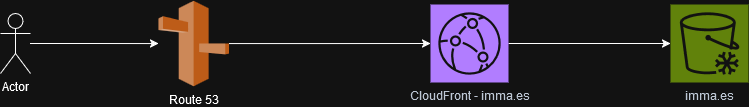

### **High-Level Architectural Diagram**

#### Overview
This architectural design is for a website infrastructure deployment on AWS, leveraging the AWS CDK (Cloud Development Kit). The primary purpose of this stack is to deploy a static website hosted in Amazon S3, served securely through AWS CloudFront, and integrated with Route 53 for DNS management. 

The diagram illustrates the following components:
- **Amazon S3**: To store static website files.
- **AWS CloudFront**: To provide a fast, secure, and scalable content delivery network.
- **AWS Certificate Manager (ACM)**: For securing the website with HTTPS using TLS certificates.
- **Amazon Route 53**: For DNS hosting, enabling users to access the website through domain names.
- **Origin Access Identity (OAI)**: To restrict S3 bucket access only to CloudFront.

---

### **Diagram Explanation**

#### Components:
1. **S3 Bucket**:
   - Stores website files (HTML, CSS, JavaScript, etc.).
   - Configured with restricted public access and versioning enabled.
   - Uses Object Ownership to enforce bucket policies.

2. **CloudFront Distribution**:
   - Retrieves website files from the S3 bucket.
   - Uses an Origin Access Identity (OAI) to restrict access to S3 directly from the public internet.
   - Configured with a custom **Response Headers Policy** for security and caching optimization.

3. **Certificate Manager (ACM)**:
   - Manages TLS/SSL certificates for enabling HTTPS on the website.
   - Integrated with Route 53 for DNS validation.

4. **Route 53 Hosted Zone**:
   - Hosts the DNS records for the website's custom domain (e.g., `nagarjunnagesh.com` and `www.nagarjunnagesh.com`).
   - Includes A and AAAA records pointing to the CloudFront distribution.

5. **Error Pages**:
   - Custom error responses (e.g., 404 or 403 errors) redirect to the homepage to improve user experience.

#### Process Flow:
1. Users access the website by typing the domain name (`nagarjunnagesh.com`) into their browser.
2. DNS queries are resolved via **Route 53**, which directs traffic to the CloudFront distribution.
3. CloudFront retrieves website content from the S3 bucket using the Origin Access Identity (OAI).
4. Content is served securely via HTTPS, leveraging the TLS certificate managed by ACM.

---

### **High-Level Diagram**

Here's the generated high-level diagram:

#### Diagram Description:
The diagram shows:
- **Users** accessing the website through the internet.
- **Route 53** resolving domain names to the CloudFront distribution.
- **CloudFront** fetching content from an S3 bucket.
- Security components like **OAI** and **ACM** ensuring secure and restricted content delivery.

---

Here is the high-level architectural diagram for the static website infrastructure hosted on AWS. 

